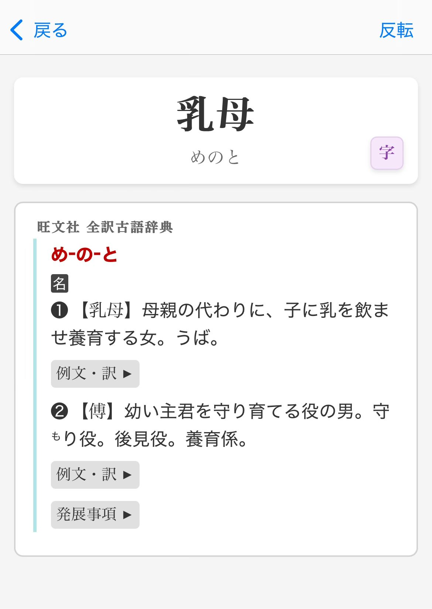

# Vertical Cards

A lovely card template for Anki that I've made for my Yomitan dictionaries . Grand for studying on any device! 

## How it looks

### Desktop
<video src="./assets/desktop-demo.mp44" width="400" controls></video>

### Mobile

- **Smart layout that adapts to your screen**: 
  - Flips horizontal when you're on your mobile or have a narrow window open
  
- **Plays nicely with dictionaries**:
  - Definitions and images are cyclable
  - Styling support for my converted Yomitan dictionaries and some others too.
  - Collapsible sections for some dictionaries

### Yomitan fields
| Field                 | Value                           |
| --------------------- | ------------------------------- |
| Word            | `{expression}`                        |
| Reading     | `{reading}`                               |
| Glossary       | `{glossary-no-dictionary}`             |
| Sentence         | `{sentence}`                         |
| Audio        | `{audio}`                               |
| DictionaryName              | `{dictionary}`            |

## Getting started

1. Pop over to the [releases page](https://github.com/kiwakiwaa/vertical-cards/releases) and download the latest version
2. Import it into your Anki
3. Create a new note type or tweak an existing one to use this template

## My yomitan dictionaries

- [My Dictionary Collection](https://drive.proton.me/urls/GH0GV6DMEC#RP55zc2DL8vD) - A wee collection of dictionaries that work brilliantly with this template